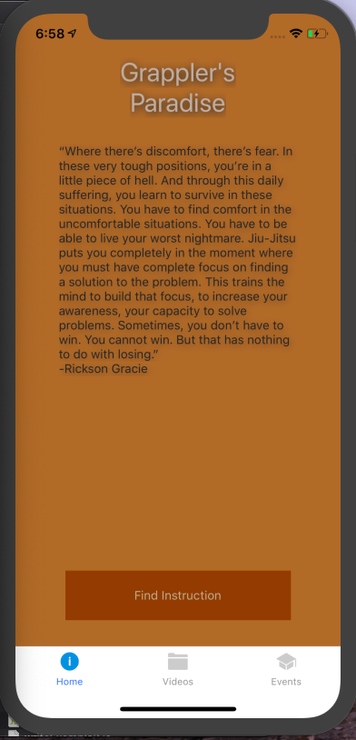
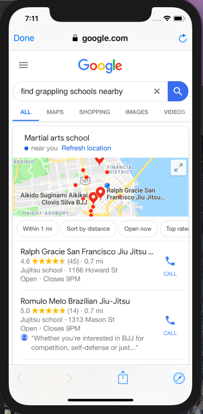
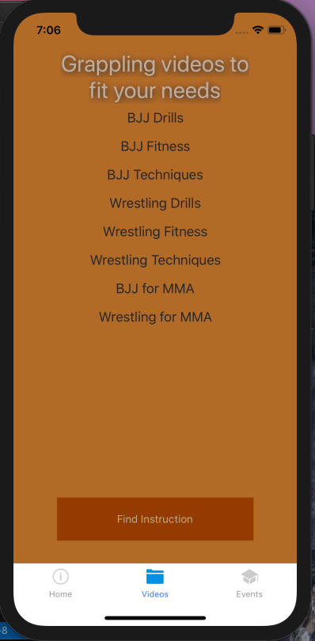
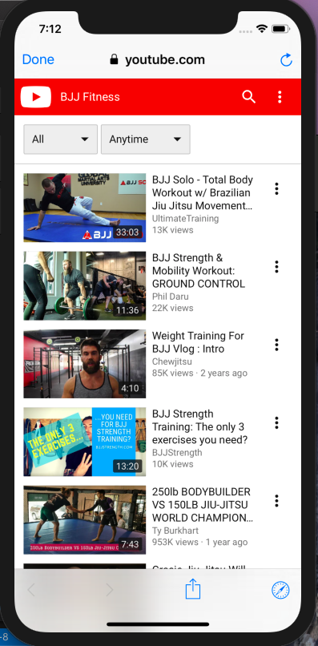
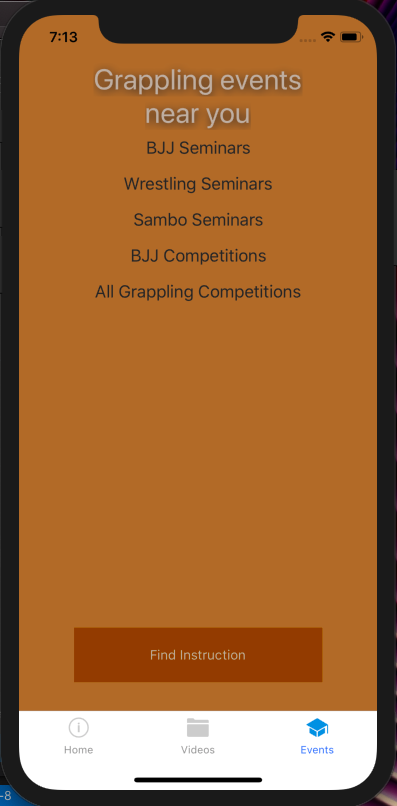
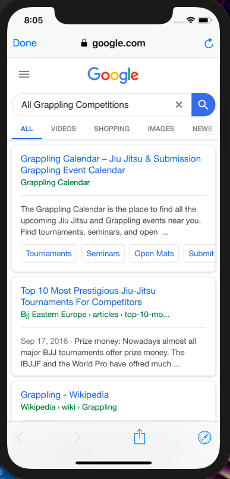

# React-native-navigate
This is a simple application that I built to learn the front-end basics of developing with React Native. It is meant to help practitioners and athletes interested in grappling sports. On each screen there is a button that finds grappling schools nearby and a navigation bar at the bottom. 
 
The video screen lists some options that are linked to youtube queries.
 
The events screen lists some options that are linked to google searches.
 